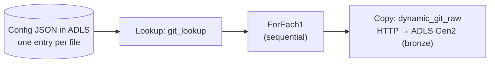

# Azure Data Factory — Ingestion (Source → Bronze)

`pipelines/dynamic_git_pipeline.json` is a **metadata-driven** pipeline: one pipeline ingests all 10 AdventureWorks files, instead of one hard-coded copy per file.

| Activity | Type | What it does |
| --- | --- | --- |
| `git_lookup` | Lookup | Reads the config JSON from ADLS Gen2 (dataset `Ds_look`) and returns all entries |
| `ForEach1` | ForEach | Loops over the entries, one at a time |
| `dynamic_git_raw` | Copy | Downloads each file over HTTP (dataset `ds_dynamic_git`) and writes it to the `bronze` container (dataset `Ds_dynamic_sink`) |

## Config format

Each entry drives one copy. See `config/lookup_config.example.json` (values are placeholders):

| Field | Used as |
| --- | --- |
| `p_rel_url` | Relative URL of the source file (parameter of `ds_dynamic_git`) |
| `p_sink_folder` | Target folder in the bronze container (e.g. `AdventureWorks_Calendar`) |
| `p_sink_file` | Target file name (parameter `p_file_name` of `Ds_dynamic_sink`) |

## Not included

The linked services and datasets (`Ds_look`, `ds_dynamic_git`, `Ds_dynamic_sink`) are separate ADF objects and are not part of this pipeline JSON. Export them from ADF (or connect ADF to Git) if you want them in the repo. Never commit credentials from linked services.
