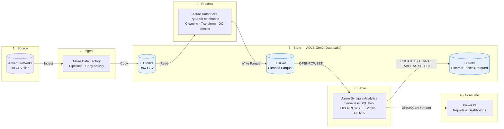
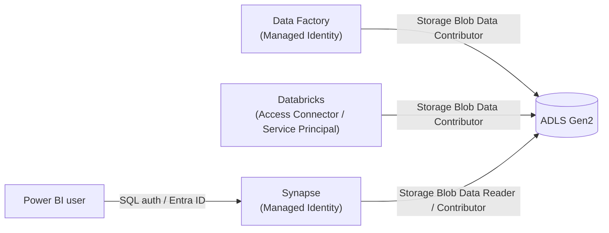
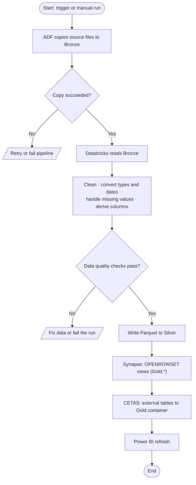
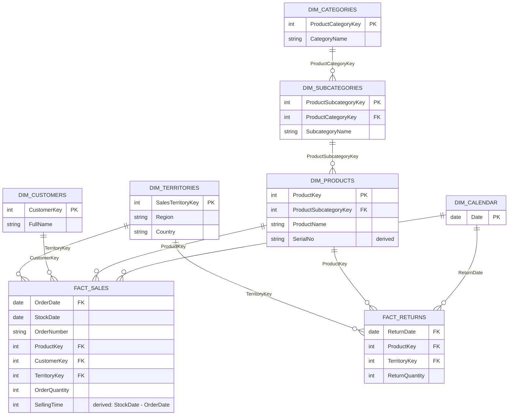

# 🚀 End-to-End Azure Data Engineering Project — AdventureWorks


A complete cloud data pipeline built on the **AdventureWorks dataset**, covering ingestion, transformation, SQL serving, and visualization. It follows the **Bronze → Silver → Gold** (medallion) architecture:

**Azure Data Factory → ADLS Gen2 → Databricks (PySpark) → Parquet → Azure Synapse Analytics → Power BI**

---

## 📑 Table of Contents

- [Project Overview](#-project-overview)
- [Architecture](#%EF%B8%8F-architecture)
  - [Solution architecture](#high-level-solution-architecture)
  - [Security and access](#security-and-access)
  - [Pipeline flow](#data-pipeline-flow)
  - [Data model](#gold-layer-data-model-star-schema)
- [Tech Stack](#%EF%B8%8F-tech-stack)
- [Dataset](#-dataset)
- [Bronze Layer](#-bronze-layer--raw-data)
- [Silver Layer](#-silver-layer--cleaned-data)
- [Gold Layer](#-gold-layer--azure-synapse-analytics)
- [Power BI](#-power-bi)
- [Data Quality](#-data-quality)
- [Project Structure](#-project-structure)
- [Getting Started](#-getting-started)
- [Key Learnings](#-key-learnings)
- [Future Improvements](#-future-improvements)
- [Author](#-author)

---

## 📌 Project Overview

The goal was to build an end-to-end pipeline that:

- Ingests source data with **Azure Data Factory**
- Lands it in **Azure Data Lake Storage Gen2**
- Cleans and transforms it with **Azure Databricks + PySpark**
- Runs data quality checks and stores results as **Parquet**
- Builds a **Gold layer** in **Azure Synapse Analytics** using `OPENROWSET`, SQL views, and external tables
- Connects the Gold datasets to **Power BI** for reporting

---

## 🏗️ Architecture

### High-level solution architecture

The solution is organised into five zones: **Ingest → Store → Process → Serve → Consume**. Each zone maps to one Azure service, and data moves through the Bronze, Silver, and Gold layers of the medallion architecture.



### Security and access

Services authenticate with **Managed Identity** and are authorised through **Azure RBAC** on the storage account, so no keys or secrets appear in code.



### Data pipeline flow



### Gold layer data model (star schema)

The Gold layer is modelled as a **star schema**. Sales and Returns are fact tables. Calendar, Products, Customers, and Territories are dimensions. Products roll up through Subcategories to Categories.



> Column lists are indicative. Adjust them to match your actual Silver schemas. `FACT_SALES` is the union of Sales 2015, 2016, and 2017.

---

## 🛠️ Tech Stack

| Technology | Purpose |
| --- | --- |
| **Azure Data Factory (ADF)** | Data ingestion and pipeline orchestration |
| **Azure Data Lake Storage Gen2** | Cloud data lake storage |
| **Azure Databricks** | Data processing and transformation |
| **PySpark** | Data cleaning and transformation |
| **Parquet** | Columnar storage format |
| **Azure Synapse Analytics** | SQL querying, external data access, Gold layer |
| **SQL** | Querying and data modeling |
| **Power BI** | Visualization and reporting |

---

## 📂 Dataset

The project uses the **AdventureWorks** dataset, made up of 10 files:

`Calendar` · `Customers` · `Product Categories` · `Product Subcategories` · `Products` · `Returns` · `Sales 2015` · `Sales 2016` · `Sales 2017` · `Territories`

---

## 🥉 Bronze Layer — Raw Data

Azure Data Factory moves the source files into the data lake unchanged.

```text
bronze/
├── AdventureWorks_Calendar
├── AdventureWorks_Customers
├── AdventureWorks_Product_Categories
├── AdventureWorks_Product_Subcategories
├── AdventureWorks_Products
├── AdventureWorks_Returns
├── AdventureWorks_Sales_2015
├── AdventureWorks_Sales_2016
├── AdventureWorks_Sales_2017
└── AdventureWorks_Territories
```

---

## 🥈 Silver Layer — Cleaned Data

Databricks and PySpark clean and transform the Bronze data, and the results are written to ADLS Gen2 as **Parquet**.

**Transformations**

- Data type and date conversion
- Missing-value handling
- String manipulation and column splitting
- Derived columns
- Aggregations where required

**Example — derived column**

```python
df_products = df_products.withColumn(
    "Serial No",
    concat(col("ProductKey"), lit("-"), col("ProductSubcategoryKey"))
)
```

**Example — date conversion**

```python
df_returns = df_returns.withColumn(
    "ReturnDate",
    to_date("ReturnDate", "M/d/yyyy")
)
```

**Example — date difference**

```python
df_sales_2015 = df_sales_2015.withColumn(
    "Selling Time",
    datediff(col("StockDate"), col("OrderDate"))
)
```

---

## 🥇 Gold Layer — Azure Synapse Analytics

Synapse exposes the Silver Parquet data as an analytics-ready layer for Power BI.

### 1. Credential and external data source

A managed identity credential is used, so no keys or secrets are stored in the code.

```sql
CREATE DATABASE SCOPED CREDENTIAL cred_papu
WITH IDENTITY = 'Managed identity';

CREATE EXTERNAL DATA SOURCE source_gold
WITH (
    LOCATION = 'https://<storage-account>.blob.core.windows.net/gold/',
    CREDENTIAL = cred_papu
);
```

### 2. External file format

```sql
CREATE EXTERNAL FILE FORMAT format_parquet
WITH (
    FORMAT_TYPE = PARQUET,
    DATA_COMPRESSION = 'org.apache.hadoop.io.compress.SnappyCodec'
);
```

### 3. Gold views with `OPENROWSET`

A view is created over each Silver dataset (Calendar, Customers, Product Categories, Product Subcategories, Products, Returns, Sales 2015–2017, Territories).

```sql
CREATE VIEW Gold.Products
AS
SELECT *
FROM OPENROWSET(
    BULK 'https://<storage-account>.blob.core.windows.net/silver/AdventureWorks_Products/',
    FORMAT = 'PARQUET'
) AS QUERY2;
```

### 4. External tables (CETAS)

The output of a Gold view is persisted as Parquet in the Gold container and stays queryable through SQL.

```sql
CREATE EXTERNAL TABLE extcalendar
WITH (
    LOCATION = 'ext_calendar',
    DATA_SOURCE = source_gold,
    FILE_FORMAT = format_parquet
)
AS
SELECT * FROM Gold.Calendar;
```

---

## 📈 Power BI

The Gold datasets from Synapse are connected to **Power BI** to build reports and dashboards.

> 💡 Add dashboard screenshots here, e.g. ``

---

## 🧪 Data Quality

Checks run during transformation, before data reaches Gold:

- Data type and date validation
- Missing-value and invalid-value handling
- Derived-column and transformation validation
- Verification of Silver Parquet output
- Validation of Gold SQL views and external tables

---

## 📁 Project Structure

```text
Azure-AdventureWorks-DataEngineering/
├── ADF/
│   └── pipelines/
├── Databricks/
│   └── notebooks/
├── Synapse/
│   ├── external_data_sources.sql
│   ├── external_file_formats.sql
│   ├── gold_views.sql
│   └── external_tables.sql
├── PowerBI/
│   └── dashboards/
├── Documentation/
│   └── architecture/
└── README.md
```

---

## ⚙️ Getting Started

**Prerequisites:** an Azure subscription with Data Factory, a Storage Account (ADLS Gen2, hierarchical namespace enabled), Databricks, and a Synapse workspace; Power BI Desktop.

1. **Create containers** `bronze`, `silver`, and `gold` in your ADLS Gen2 account.
2. **Ingest data:** import the pipelines from `ADF/pipelines/` and run them to load the AdventureWorks files into `bronze`.
3. **Transform:** run the notebooks in `Databricks/notebooks/` to write cleaned Parquet to `silver`.
4. **Serve:** run the scripts in `Synapse/` in order: data sources → file formats → views → external tables. Replace `<storage-account>` with your account name.
5. **Visualize:** connect Power BI to the Synapse serverless SQL endpoint and load the Gold views.

> ⚠️ Never commit storage keys, connection strings, or tokens. Use managed identity or Azure Key Vault.

---

## 🎯 Key Learnings

- Building ingestion pipelines with Azure Data Factory
- Designing a Bronze/Silver/Gold architecture on ADLS Gen2
- Data cleaning, transformation, and quality checks with PySpark
- Serving Parquet data through Synapse with `OPENROWSET`, external data sources, file formats, views, and external tables
- Connecting a SQL serving layer to Power BI

---

## 🚀 Future Improvements

- [ ] Incremental data loading
- [ ] Metadata-driven pipelines
- [ ] Automated pipeline monitoring and alerting
- [ ] Advanced data quality framework
- [ ] CI/CD for ADF, Databricks, and Synapse
- [ ] Performance optimization and data partitioning
- [ ] Incremental refresh in Power BI
- [ ] Additional business-level transformations

---

## 👨‍💻 Author

**Abinash Sahoo**
Electronics & Telecommunication Engineering, IGIT Sarang
Interested in Data Engineering, Cloud Technologies, Analytics, and FinTech.

[LinkedIn](https://www.linkedin.com/in/your-profile) · [GitHub](https://github.com/your-username)

---

⭐ If you found this project useful, consider giving it a star!
