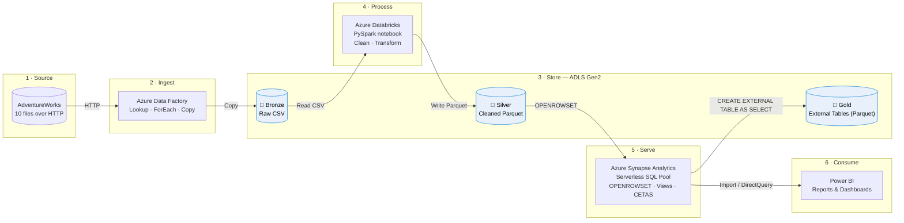
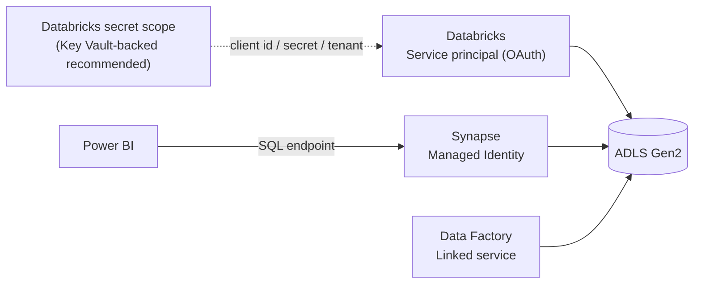
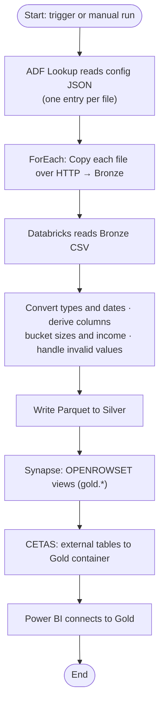
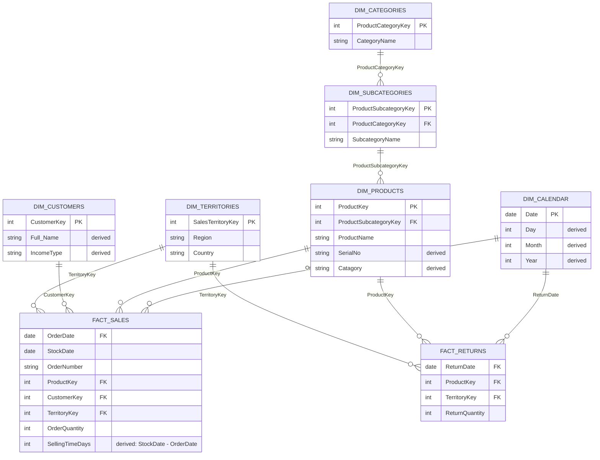

# 🚀 End-to-End Azure Data Engineering Project — AdventureWorks


A complete cloud data pipeline built on the **AdventureWorks dataset**, covering ingestion, transformation, SQL serving, and visualization. It follows the **Bronze → Silver → Gold** (medallion) architecture:

**Azure Data Factory → ADLS Gen2 → Databricks (PySpark) → Parquet → Azure Synapse Analytics → Power BI**

---

## 📑 Table of Contents

- [Project Overview](#-project-overview)
- [Architecture](#%EF%B8%8F-architecture)
- [Tech Stack](#%EF%B8%8F-tech-stack)
- [Dataset](#-dataset)
- [Bronze Layer](#-bronze-layer--raw-data)
- [Silver Layer](#-silver-layer--cleaned-data)
- [Gold Layer](#-gold-layer--azure-synapse-analytics)
- [Power BI](#-power-bi)
- [Data Validation](#-data-validation)
- [Repository Structure](#-repository-structure)
- [Getting Started](#%EF%B8%8F-getting-started)
- [Key Learnings](#-key-learnings)
- [Future Improvements](#-future-improvements)
- [Author](#-author)

---

## 📌 Project Overview

The goal was to build an end-to-end pipeline that:

- Ingests source files with a **metadata-driven Azure Data Factory pipeline** (Lookup → ForEach → Copy)
- Lands them in **Azure Data Lake Storage Gen2** (Bronze)
- Cleans and transforms them with **Azure Databricks + PySpark** and stores **Parquet** (Silver)
- Builds a **Gold layer** in **Azure Synapse Analytics** using `OPENROWSET`, SQL views, and external tables
- Connects the Gold datasets to **Power BI** for reporting

---

## 🏗️ Architecture

### High-level solution architecture

The solution is organised into zones: **Source → Ingest → Store → Process → Serve → Consume**. Data moves through the Bronze, Silver, and Gold layers of the medallion architecture.



### Security and access

| Component | How it authenticates to ADLS Gen2 |
| --- | --- |
| Azure Databricks | Service principal (OAuth client credentials). Client ID, secret and tenant ID are read from a **Databricks secret scope**, never hard-coded |
| Azure Synapse | **Managed Identity** through a database-scoped credential |
| Azure Data Factory | Linked service (configured in ADF) |



### Data pipeline flow



### Logical data model (star schema)

AdventureWorks has a star-schema shape: Sales and Returns are fact tables; Calendar, Products, Customers, and Territories are dimensions. Products roll up through Subcategories to Categories. Gold exposes Sales 2015, 2016, and 2017 as three separate tables, which are treated as one logical `FACT_SALES`.



> Column lists are indicative. Relationships are defined in Power BI's model view.

---

## 🛠️ Tech Stack

| Technology | Purpose |
| --- | --- |
| **Azure Data Factory (ADF)** | Metadata-driven ingestion and orchestration |
| **Azure Data Lake Storage Gen2** | Cloud data lake storage |
| **Azure Databricks** | Data processing and transformation |
| **PySpark** | Data cleaning and transformation |
| **Parquet** | Columnar storage format |
| **Azure Synapse Analytics** | SQL querying, external data access, Gold layer |
| **SQL** | Querying and data modeling |
| **Power BI** | Visualization and reporting |

---

## 📂 Dataset

The project uses the **AdventureWorks** dataset, made up of 10 files:

`Calendar` · `Customers` · `Product Categories` · `Product Subcategories` · `Products` · `Returns` · `Sales 2015` · `Sales 2016` · `Sales 2017` · `Territories`

---

## 🥉 Bronze Layer — Raw Data

The ADF pipeline [`dynamic_git_pipeline`](ADF/pipelines/dynamic_git_pipeline.json) loads all files into the `bronze` container with a single **Lookup → ForEach → Copy** flow driven by a config JSON. See [ADF/README.md](ADF/README.md).

```text
bronze/
├── AdventureWorks_Calendar
├── AdventureWorks_Customers
├── AdventureWorks_Product_Categories
├── AdventureWorks_Product_Subcategories
├── AdventureWorks_Products
├── AdventureWorks_Returns
├── AdventureWorks_Sales_2015
├── AdventureWorks_Sales_2016
├── AdventureWorks_Sales_2017
└── AdventureWorks_Territories
```

---

## 🥈 Silver Layer — Cleaned Data

The notebook [`silver_layer.ipynb`](Databricks/notebooks/silver_layer.ipynb) reads each Bronze dataset, transforms it, and writes **Parquet** to the `silver` container.

| Dataset | Transformations |
| --- | --- |
| Calendar | `Date` converted to a date type; `Day`, `Month`, `Year` derived |
| Customers | `Full_Name` built from prefix, first and last name; `Income Type` band (High / Medium / Low) from `AnnualIncome` |
| Products | `Serial No` (`ProductKey-ProductSubcategoryKey`); `Catagory` split from `ProductName`; `ProductSize` mapped to S / M / L / XL, with `0` set to null |
| Returns | `ReturnDate` converted to a date type |
| Sales 2015–2017 | `OrderDate` and `StockDate` converted to dates; `Selling Time(In Days)` derived |
| Categories, Subcategories, Territories | Loaded as-is to Parquet |

**Example — derived column**

```python
df_products = df_products.withColumn(
    "Serial No",
    concat(col("ProductKey"), lit("-"), col("ProductSubcategoryKey"))
)
```

**Example — date difference**

```python
df_sales = (
    df_sales
    .withColumn("OrderDate", to_date("OrderDate", "M/d/yyyy"))
    .withColumn("StockDate", to_date("StockDate", "M/d/yyyy"))
    .withColumn("Selling Time(In Days)", datediff(col("StockDate"), col("OrderDate")))
)
```

Storage access uses a service principal, with credentials read from a Databricks secret scope (see [Getting Started](#%EF%B8%8F-getting-started)).

---

## 🥇 Gold Layer — Azure Synapse Analytics

Synapse (serverless SQL pool) exposes the Silver Parquet data as an analytics-ready layer. Scripts are in [`Synapse/`](Synapse) and are numbered in run order.

| Script | Purpose |
| --- | --- |
| `00_create_schema.sql` | Creates the `gold` schema |
| `01_external_data_sources.sql` | Managed-identity credential; `source_silver` and `source_gold` data sources |
| `02_external_file_formats.sql` | `format_parquet` (Parquet, Snappy) |
| `03_gold_views.sql` | One `gold.*` view per dataset, using `OPENROWSET` |
| `04_external_tables.sql` | External tables (CETAS) written to the `gold` container |

**Credential and data source**

```sql
CREATE DATABASE SCOPED CREDENTIAL cred_papu
WITH IDENTITY = 'Managed Identity';

CREATE EXTERNAL DATA SOURCE source_gold
WITH (
    LOCATION   = 'https://<storage-account>.dfs.core.windows.net/gold/',
    CREDENTIAL = cred_papu
);
```

**Gold view with `OPENROWSET`**

```sql
CREATE OR ALTER VIEW gold.products
AS
SELECT *
FROM OPENROWSET(
    BULK 'https://<storage-account>.blob.core.windows.net/silver/AdventureWorks_Products/*.parquet',
    FORMAT = 'PARQUET'
) AS QUERY2;
```

**External table (CETAS)** — persists the result of a Gold view as Parquet while keeping it queryable through SQL.

```sql
CREATE EXTERNAL TABLE ext_calendar
WITH (
    LOCATION    = 'calendar',
    DATA_SOURCE = source_gold,
    FILE_FORMAT = format_parquet
) AS
SELECT * FROM gold.calendar;
```

---

## 📈 Power BI

The Gold datasets from Synapse are connected to **Power BI** to build reports and dashboards.

> 💡 Add dashboard screenshots to `PowerBI/dashboards/` and embed them here, e.g. ``

---

## 🧪 Data Validation

- Date and data-type conversion in the Silver layer
- Invalid product sizes (`0`) handled as nulls; NULL-safe name concatenation
- Derived columns checked by inspecting the output
- Row counts of every Silver dataset verified in the notebook's final cell
- Gold views and external tables validated by querying them in Synapse

---

## 📁 Repository Structure

```text
Azure-AdventureWorks-DataEngineering/
├── ADF/
│   ├── README.md
│   ├── config/
│   │   └── lookup_config.example.json
│   └── pipelines/
│       └── dynamic_git_pipeline.json
├── Databricks/
│   └── notebooks/
│       └── silver_layer.ipynb
├── Synapse/
│   ├── 00_create_schema.sql
│   ├── 01_external_data_sources.sql
│   ├── 02_external_file_formats.sql
│   ├── 03_gold_views.sql
│   └── 04_external_tables.sql
├── PowerBI/
│   └── dashboards/
├── Documentation/
│   └── architecture/
├── .gitignore
└── README.md
```

---

## ⚙️ Getting Started

**Prerequisites:** an Azure subscription with Data Factory, a Storage Account (ADLS Gen2, hierarchical namespace enabled), Databricks, and a Synapse workspace; Power BI Desktop.

1. **Create containers** `bronze`, `silver`, and `gold` in your ADLS Gen2 account.
2. **Ingest:** import `ADF/pipelines/dynamic_git_pipeline.json`, create the linked services and datasets it references, add your config JSON (see `ADF/config/`), and run the pipeline.
3. **Set up Databricks access:** register a service principal, grant it *Storage Blob Data Contributor* on the storage account, and store its client ID, client secret and tenant ID in a secret scope.
4. **Transform:** import `Databricks/notebooks/silver_layer.ipynb`, set `STORAGE_ACCOUNT` and `SECRET_SCOPE`, and run all cells.
5. **Serve:** run the scripts in `Synapse/` in numeric order (00 → 04), replacing `<storage-account>` with your account name.
6. **Visualize:** connect Power BI to the Synapse serverless SQL endpoint and load the Gold tables.

> ⚠️ Never commit storage keys, client secrets, connection strings, or tokens. Use secret scopes, Key Vault, or managed identity.

---

## 🎯 Key Learnings

- Building metadata-driven ingestion pipelines with Azure Data Factory
- Designing a Bronze/Silver/Gold architecture on ADLS Gen2
- Data cleaning and transformation with PySpark
- Secure storage access with service principals and secret scopes
- Serving Parquet data through Synapse with `OPENROWSET`, external data sources, file formats, views, and external tables
- Connecting a SQL serving layer to Power BI

---

## 🚀 Future Improvements

- [ ] Incremental data loading
- [ ] Automated data quality checks (e.g. Great Expectations or Deequ)
- [ ] Pipeline monitoring and alerting
- [ ] Key Vault-backed secret scope
- [ ] Delta Lake in the Silver layer
- [ ] CI/CD for ADF, Databricks, and Synapse
- [ ] Performance optimization and data partitioning
- [ ] Incremental refresh in Power BI

---

## 👨‍💻 Author

**Abinash Sahoo**
Electronics & Telecommunication Engineering, IGIT Sarang
Interested in Data Engineering, Cloud Technologies, Analytics, and FinTech.

[LinkedIn](linkedin.com/in/sahooabinash072) · [GitHub](github.com/Abinash072)

---

⭐ If you found this project useful, consider giving it a star!
